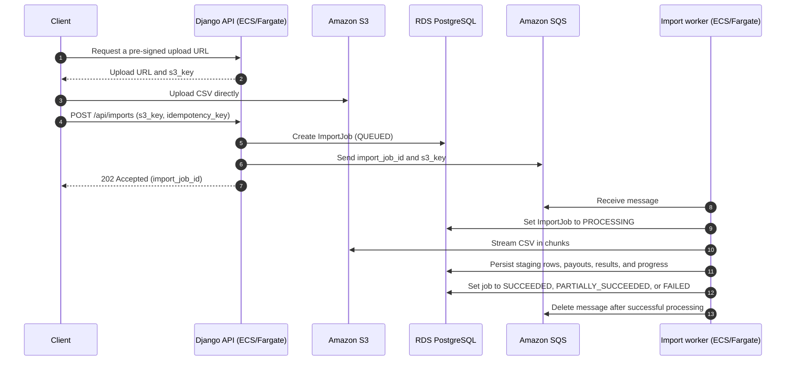
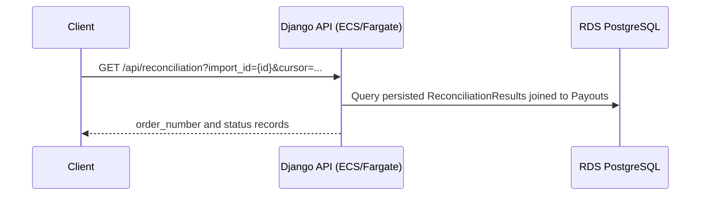

# Payout Reconciliation Service

A Django + Django REST Framework service that imports payout CSV rows,
reconciles them against source-of-truth orders, stores each outcome, and exposes
the persisted results. SQLite is the local development database.

## Project structure

```text
.
├── config/                         # Django settings and root URL/WSGI/ASGI configuration
├── reconciliation/                 # Reconciliation application
│   ├── management/commands/        # seed_orders management command
│   ├── migrations/                 # Database schema migrations
│   ├── tests/                      # Model, service, API, and bootstrap tests
│   ├── models.py                   # Order, Payout, and ReconciliationResult models
│   ├── serializers.py              # Upload validation and response serialization
│   ├── services.py                 # CSV parsing, import, and reconciliation workflow
│   ├── urls.py                     # Application API routes
│   └── views.py                    # HTTP endpoint coordination
├── requirements/                   # Supplied assessment brief and source CSV files
├── postman/                        # Collection, local environment, sample CSV, and result screenshots
├── plans/                          # Phased implementation plans and validation evidence
├── .agents/                        # Repository rules and task-specific AI review skills
├── manage.py                       # Django command entry point
├── requirements.txt                # Python dependencies
└── README.md                       # Setup, API, validation, and design documentation
```

## Setup and run

Prerequisite: Python 3.12 or newer.

```bash
python3 -m venv .venv
source .venv/bin/activate
python -m pip install -r requirements.txt
python manage.py migrate
python manage.py seed_orders
python manage.py runserver
```

`seed_orders` loads the ten supplied orders from `requirements/orders.csv` and
is safe to rerun: it updates orders by `order_number`. The local server runs at
`http://127.0.0.1:8000`; its ignored SQLite database is `db.sqlite3`.

### Configuration

Local development defaults to `DJANGO_DEBUG=true`. For a non-local environment,
export a real secret and allowed hosts before starting Django:

```bash
export DJANGO_DEBUG=false
export DJANGO_SECRET_KEY='replace-with-a-long-random-secret'
export DJANGO_ALLOWED_HOSTS='api.example.com'
```

[.env.example](.env.example) documents available variables, but it is a
reference template only: this project does not automatically load `.env` files.
`DJANGO_SECRET_KEY` is required whenever debug mode is disabled.

## API

### `POST /api/payouts/upload`

Send multipart form-data with a `file` field. The default upload limit is 5 MiB;
when a content type is supplied it must be `text/csv` or `application/csv`.
The CSV header must be exactly:

```text
provider,order_number,amount,currency
```

Rows are fully parsed and validated as `Decimal` values before a transaction
creates a `Payout` and its persisted `ReconciliationResult`. Re-uploading a
file intentionally creates new payout rows for this assessment.

```bash
curl -X POST http://127.0.0.1:8000/api/payouts/upload \
  -F 'file=@requirements/payouts.csv;type=text/csv'
```

Success returns `201`:

```json
{"imported_count": 9}
```

Malformed headers, invalid or missing values, empty/absent files, oversized
files, and rejected MIME types return `400` with client-safe errors. Failed
uploads never leave a partial import.

### `GET /api/reconciliation`

Returns only stored results, ordered by `order_number` and result ID. It never
recalculates on read.

```bash
curl http://127.0.0.1:8000/api/reconciliation
```

```json
{"order_number": "100003", "status": "Amount Mismatch"}
```

Import precedence is `Missing Order`, `Currency Mismatch`, `Amount Mismatch`,
then `Matched`. The supplied sample produces `Amount Mismatch` for `100003`,
`Currency Mismatch` for `100009`, and `Missing Order` for `100011` and `100012`.

## Data model

The three assessment-domain tables are:

- `reconciliation_order`: source-of-truth order number, total amount, currency.
- `reconciliation_payout`: one imported CSV row.
- `reconciliation_reconciliationresult`: one-to-one persisted payout status.

`auth_*`, `django_*`, and `django_session` are standard Django infrastructure
tables created by enabled framework apps, not assessment-domain tables.

## Tests

Run the isolated test suite:

```bash
python manage.py test reconciliation
```

Useful preflight checks:

```bash
python manage.py makemigrations --check
python manage.py check
```

Coverage includes model constraints, order seeding, all statuses and precedence,
Decimal-safe comparison, full-file validation, transactional failure behavior,
upload validation, and persisted read behavior.

## Postman

1. Start the service and run `python manage.py seed_orders`.
2. Import [the collection](postman/payout-reconciliation.postman_collection.json).
3. Import/select [the local environment](postman/payout-reconciliation.local.postman_environment.json).
4. In **Upload payouts CSV**, select [postman/payouts.csv](postman/payouts.csv)
   for the multipart `file` field if Postman does not resolve its relative path.
5. Run **Upload payouts CSV**, then **Get reconciliation results**.

The collection asserts `201`, `imported_count: 9`, `200`, and the four required
outcomes. With the server running, it can also run through Newman:

```bash
npx -y newman@6.2.1 run postman/payout-reconciliation.postman_collection.json \
  -e postman/payout-reconciliation.local.postman_environment.json
```

## Scaling to 500,000 records

The synchronous SQLite implementation is intentionally scoped to small files.
For imports of 500,000 records or more, move the import and reconciliation work
to an asynchronous job architecture backed by PostgreSQL.

```text
Client → request an upload URL from the API → upload the CSV directly to S3
       → create an ImportJob → enqueue {import_job_id, s3_key} in SQS
       → receive 202 Accepted

Worker → receive the SQS message → stream the CSV from S3 in chunks
       → validate and reconcile each chunk against indexed orders
       → persist payouts and reconciliation results in PostgreSQL
       → update the ImportJob status and progress
```

### Asynchronous import workflow



### Reconciliation result retrieval

The read path is deliberately separate from import processing. It reads the
persisted status and never recalculates reconciliation. The current assessment
endpoint is `GET /api/reconciliation`; `import_id` and cursor pagination are
production extensions for large, multi-import datasets.



### AWS service mapping

| Component | AWS service | Responsibility |
| --- | --- | --- |
| Public API | ECS on Fargate + Application Load Balancer | Runs Django/DRF endpoints that issue upload URLs, create ImportJobs, and serve status and result APIs. |
| CSV object storage | Amazon S3 | Stores original CSV files; clients upload directly using time-limited pre-signed URLs. |
| Import metadata and reconciliation data | Amazon RDS for PostgreSQL | Stores ImportJobs, staged rows, Orders, Payouts, ReconciliationResults, and per-row errors. |
| Work dispatch | Amazon SQS + dead-letter queue | Buffers lightweight job messages, decouples API from workers, retries failed deliveries, and isolates exhausted failures. |
| Long-running processing | ECS on Fargate | Runs independently scalable workers that stream, validate, reconcile, and persist imports. |
| Logs, metrics, and alerts | Amazon CloudWatch | Captures structured logs and monitors job failures, processing time, queue depth, and error rates. |
| Secrets and access control | AWS Secrets Manager + IAM | Stores database secrets and grants each workload only the permissions it needs. |

## Production readiness

Before deployment, add:

- Authentication, role/tenant authorization, rate limits, and audit logs.
- TLS, restrictive CORS, `DEBUG=false`, secure configuration, and secret rotation.
- Object-storage uploads, stricter content inspection/anti-malware scanning,
  quotas, and a durable import/error-report lifecycle.
- Idempotency keys, retries, dead-letter queues, and operator tooling for failures.
- Structured logs, correlation IDs, metrics, traces, error monitoring, alerts,
  dashboards, CI checks, dependency scanning, migration controls, backups,
  restore drills, and disaster-recovery testing.

## Validation performed

During implementation:

- `python manage.py migrate` succeeded on a fresh SQLite database.
- `python manage.py makemigrations --check` reported no changes.
- `python manage.py check` reported no issues.
- `python manage.py test reconciliation` created/destroyed an isolated test DB;
  the final validation run passed 23 tests.
- Local HTTP smoke tests returned `201 {"imported_count":9}` for the supplied
  payout file, `400` for an invalid header, and the expected persisted results.
- Newman completed 2 requests and 4 assertions with 0 failures.
- The focused Django reconciliation review had no blocking or important findings.

## AI Usage

OpenAI Codex and Anthropic Claude were used as AI coding assistants for
planning, implementation, test generation, code review, and documentation.
Their output followed a repository-defined process rather than being accepted
unreviewed:

- Before implementation, Codex read the repository instructions and the
  reviewer-visible domain, Django, security, validation, and engineering rules
  in `.agents/rules/`.
- The `plans/` directory is a reusable planning system: each feature, bug fix,
  refactor, or investigation receives its own numbered plan. A plan is divided
  into phases with scope, dependencies, decisions, acceptance criteria, status,
  and validation evidence. For this assessment, the plan is
  `plans/001-reconciliation-service/FEATURE-PLAN.md`.
- This plan was the working context shared with Codex. It provided an overview
  of the work, structured the implementation order, tracked completed and
  remaining phases, and made it possible to pause and resume work days later
  without losing technical decisions, progress, or validation context.
- Codex helped generate the Django project, domain models, CSV import and
  reconciliation service, API endpoints, tests, Postman assets, and README
  documentation. The implementation owner reviewed the generated changes and
  made the final design and acceptance decisions.
- For repeatable, task-specific work, repository-scoped skills are created to
  guide AI execution and review generated code. For this service, the
  `django-reconciliation-verifier` skill checked source-of-truth order lookups,
  `Decimal` money handling, atomic full-file validation, reconciliation
  precedence, persisted read behavior, upload safety, and regression coverage.

The AI review skill was supplemented by authored and executable automated tests
at the model, service, and API layers, so generated code was checked by both
review guidance and repeatable behavior tests. Validation included `python
manage.py migrate` on a fresh local SQLite database, `python manage.py
makemigrations --check`, `python manage.py check`, and `python manage.py test
reconciliation` (23 passing tests). The service was also exercised through
local HTTP smoke tests and a Newman run of the Postman collection (2 requests
and 4 assertions, all passing). These checks verified the required sample
outcomes, transactional failure behavior, API contracts, and persisted
reconciliation results.
